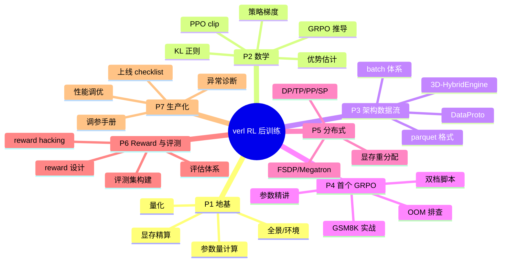

# 📊 学习仪表盘 — 基于 verl 的企业级大模型 RL 后训练

> 单一真相来源见 [[curriculum]]。本页是快速导航与状态快照。

## 🎯 当前状态
- **当前 Phase**：🎉 全部 7 个 Phase 已完成（42 课），进入复习与期末项目阶段
- **教学模式**：🧠 苏格拉底（理论） + 🛠️ 示范驱动（工程）
- **主线算法**：GRPO（对比 PPO / DAPO）
- **实验模型**：Qwen3-1.7B/4B（小资源） · Qwen3-8B（集群）

## 🗺️ 学习路线图
可视化见 `learning-roadmap.canvas`（用 Obsidian 打开本库）。

## 📚 Phase 导航
- [[01-foundations/]] — Phase 1 地基
- [[02-math/]] — Phase 2 数学原理
- [[03-architecture/]] — Phase 3 架构与数据流
- [[04-first-grpo/]] — Phase 4 首个 GRPO
- [[05-distributed/]] — Phase 5 分布式训练
- [[06-reward-eval/]] — Phase 6 Reward 与评测
- [[07-production/]] — Phase 7 生产化

## 📈 总进度
Phase 1：██████████ 100% · Phase 2：██████████ 100% · Phase 3：██████████ 100%
Phase 4：██████████ 100% · Phase 5：██████████ 100% · Phase 6：██████████ 100% · Phase 7：██████████ 100%

**总课时**：42/42 🎉

## 🕘 最近更新
- 2026-07-20：知识库初始化，课程骨架就绪。
- 2026-07-20：✅ 全部 7 个 Phase、42 篇详细笔记 + 4 个可运行实验脚本完成。
