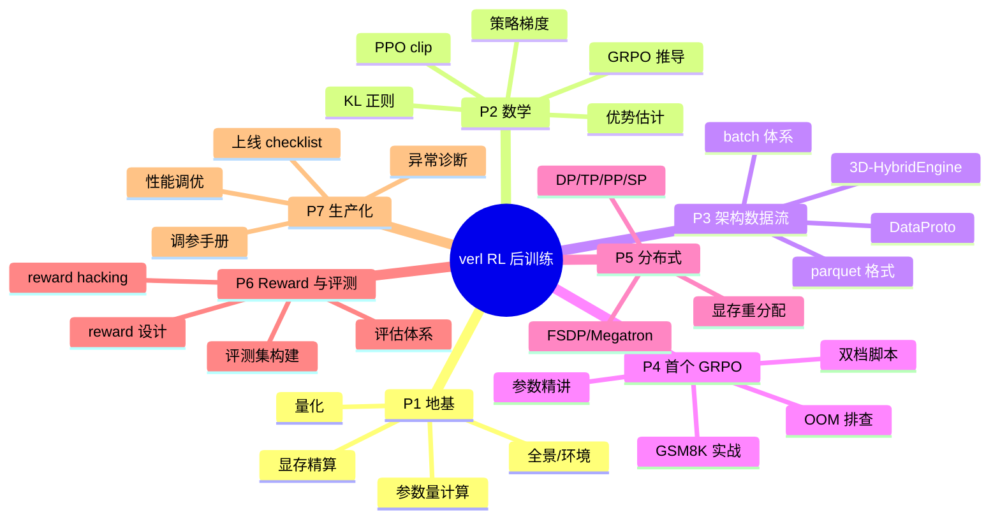

# 📊 学习仪表盘 — 基于 verl 的企业级大模型 RL 后训练

> 单一真相来源见 [[curriculum]]。本页是快速导航与状态快照。

## 🎯 当前状态
- **当前 Phase**：Phase 1 地基，42 课待完成
- **教学模式**：🧠 苏格拉底（理论） + 🛠️ 示范驱动（工程）
- **主线算法**：GRPO（对比 PPO / DAPO）
- **实验模型**：Qwen3-1.7B/4B（小资源） · Qwen3-8B（集群）

## 🗺️ 学习路线图
可视化见 `learning-roadmap.canvas`（用 Obsidian 打开本库）。

## 📚 Phase 导航
- [[01-foundations/]] — Phase 1 地基
- [[02-math/]] — Phase 2 数学原理
- [[03-architecture/]] — Phase 3 架构与数据流
- [[04-first-grpo/]] — Phase 4 首个 GRPO
- [[05-distributed/]] — Phase 5 分布式训练
- [[06-reward-eval/]] — Phase 6 Reward 与评测
- [[07-production/]] — Phase 7 生产化

## 📈 总进度
Phase 1：██████████ 100% 🎉 · Phase 2：████░░░░░░ 33% · Phase 3：░░░░░░░░░░ 0%
Phase 4：░░░░░░░░░░ 0% · Phase 5：░░░░░░░░░░ 0% · Phase 6：░░░░░░░░░░ 0% · Phase 7：░░░░░░░░░░ 0%

**总课时**：8/42

## 🕘 最近更新
- 2026-07-20：知识库初始化，课程骨架就绪。
- 2026-07-21：⬜ 全部进度重置，42 课待开始学习。
- 2026-07-26：✅ 完成 1.4 量化基础（含常见量化方法与面试推导、Loss Scaling 详解）。
- 2026-07-26：✅ 完成 1.5 显存分配精算（含降激活三大手段详解、各组件 offload 支持总览）。
- 2026-07-29：✅ 完成 1.6 选卡实战（含 batch 三级关系速查）、2.1 RL 基础、2.2 PPO clip。Phase 1 全部完成，进入 Phase 2 数学原理。
